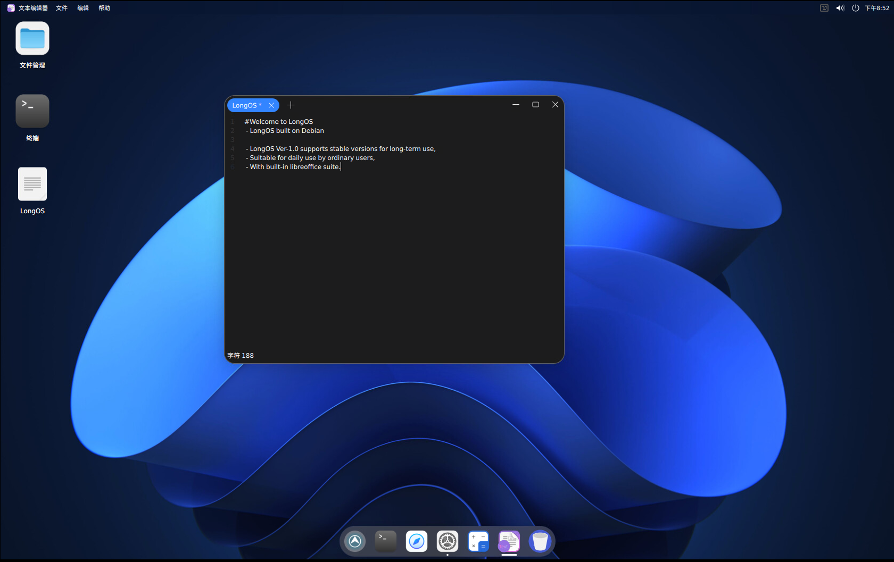

# Text Editor

A text editor specifically designed for LongOS. 




## Dependencies

### Debian/Ubuntu

```
sudo apt install equivs curl git devscripts lintian build-essential automake autotools-dev --no-install-recommends
```

## Build

```shell
mkdir build
cd build
cmake -DCMAKE_INSTALL_PREFIX:PATH=/usr ..
make
```

## Install

```shell
sudo make install
```

## License

This project has been licensed by GPLv3.
